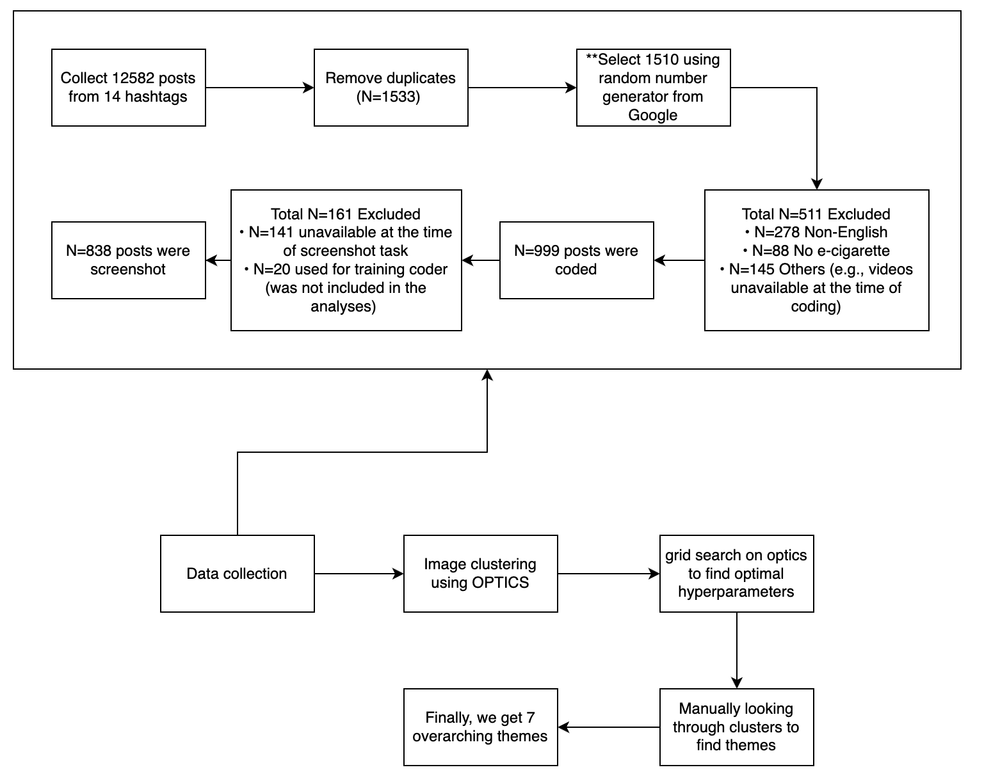

# Image Clustering
Image clustering on TikTok video snapshots to identify vaping trends: Made as a part of the Computational Media Lab

## Process
The following diagram is a nutshell of our evaluation procedure. Corresponding datasets and scripts are attached in this repository with more detailed instructions below.




## Data Collection

We collected data over several days using [this repository.](https://github.com/drawrowfly/tiktok-scraper) 

## Data Preparation

We had a research assistant capture the most salient frame from every video. After removal of duplicates and other cleaning steps, we had our dataset of images.

## Code

### Google Colab

The Jupyter notebook present in [colab-run](colab-run) can be used to directly run on Google Colab. You can open the file in Google Colab and all file imports will be handled directly over there. The file paths in images_path should point to the directory where your images are stores.

### Local

First, you have to download tensorflow for your system by following instructions for your operating system [from this source.](https://www.tensorflow.org/install). Generally, the following command can be run:

``` pip install tensorflow ```

Then, make sure img_names variable in [experiment.py](experiment.py) points to the folder where your image screenshots are stored.

Finally, you can run our experiments from [gridsearch.py](gridsearch.py). If you would like to modify any of clustering, dimensionality reduction, or embedding algorithms, you can add corresponding functions in the named files and then accordingly modify [experiment.py](experiment.py). 


